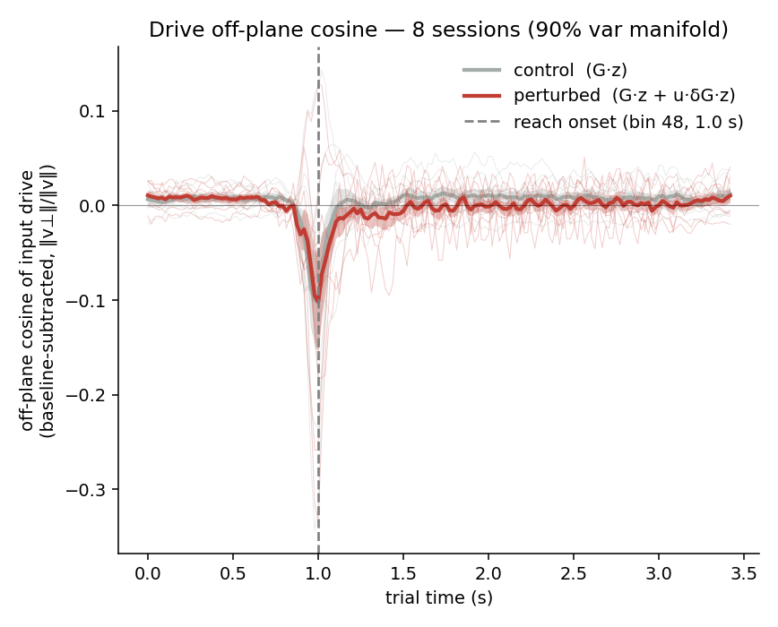

# Cross-session summary — input-drive off-plane cosine

*Auto-generated by `run_session_summary_plot.py`. PLDS analog of the old calcium `all_session_summary_plot`.*

## What is plotted
- **Quantity**: off-plane *cosine* of the latent input drive = `‖v⊥‖/‖v‖` (the principal cosine of the drive to the off-manifold subspace; = `|cos(drive, plane_normal)|` for a codim-1 plane).
- **Drive**: control = `G·z`, perturbed = `G·z + u·δG·z`.
- **Manifold**: top-k PCs of each session's trial-averaged unperturbed latent trajectory (per-session k below).
- **Whole trial** (absolute time); each session baseline-subtracted by the mean of its first **48 bins** (pre reach-onset).
- **Reach onset** is fixed at bin **48** (1.0 s) for every trial; this is the dashed reference line and the post-onset boundary.
- **Aggregate**: mean ± SEM across **8 sessions**; time axis bin = 25/1200 s ≈ 20.83 ms; common length T = 165 bins.

## Per-session post-onset cosine elevation (baseline-subtracted)
Post-onset = bins ≥ reach onset (48). `flip` marks sessions whose cosine sign was inverted.

| session | k | pert-onset median | flip | perturbed | control | gap |
|---|---|---|---|---|---|---|
| 0 | 2 | 53 |  | +0.0223 | +0.0024 | +0.0198 |
| 1 | 2 | 50 |  | -0.0212 | -0.0242 | +0.0030 |
| 2 | 2 | 47 |  | -0.0029 | +0.0052 | -0.0081 |
| 3 | 2 | 49 |  | +0.0200 | +0.0178 | +0.0022 |
| 4 | 1 | 49 |  | -0.0211 | +0.0250 | -0.0461 |
| 5 | 2 | 50 |  | -0.0167 | -0.0074 | -0.0094 |
| 6 | 3 | 51 |  | +0.0024 | +0.0192 | -0.0168 |
| 7 | 2 | 50 |  | -0.0082 | +0.0032 | -0.0113 |

**Across sessions** (paired Wilcoxon, perturbed > control, 1-sided): p = **0.875**; mean gap = -0.0083.

