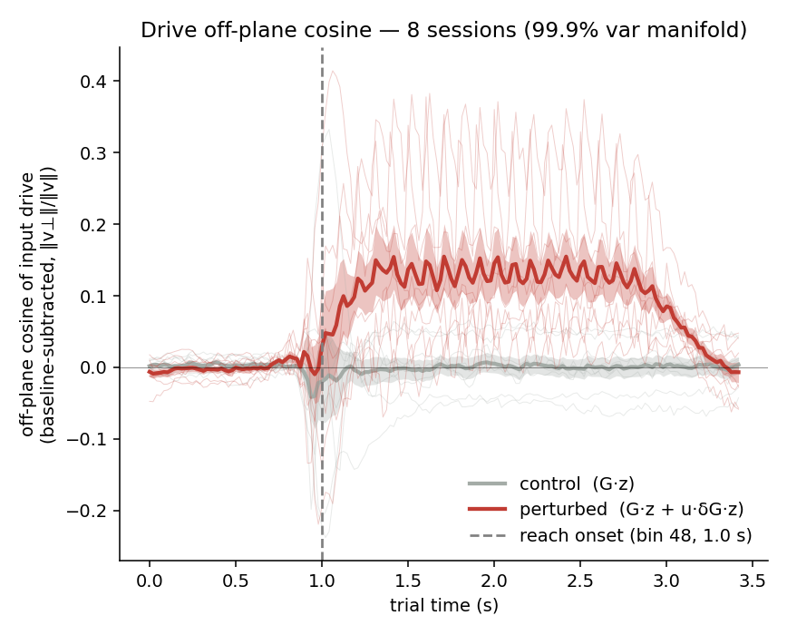

# Cross-session summary — input-drive off-plane cosine

*Auto-generated by `run_session_summary_plot.py`. PLDS analog of the old calcium `all_session_summary_plot`.*

## What is plotted
- **Quantity**: off-plane *cosine* of the latent input drive = `‖v⊥‖/‖v‖` (the principal cosine of the drive to the off-manifold subspace; = `|cos(drive, plane_normal)|` for a codim-1 plane).
- **Drive**: control = `G·z`, perturbed = `G·z + u·δG·z`.
- **Manifold**: top-k PCs of each session's trial-averaged unperturbed latent trajectory (per-session k below).
- **Whole trial** (absolute time); each session baseline-subtracted by the mean of its first **48 bins** (pre reach-onset).
- **Reach onset** is fixed at bin **48** (1.0 s) for every trial; this is the dashed reference line and the post-onset boundary.
- **Aggregate**: mean ± SEM across **8 sessions**; time axis bin = 25/1200 s ≈ 20.83 ms; common length T = 165 bins.

## Per-session post-onset cosine elevation (baseline-subtracted)
Post-onset = bins ≥ reach onset (48). `flip` marks sessions whose cosine sign was inverted.

| session | k | pert-onset median | flip | perturbed | control | gap |
|---|---|---|---|---|---|---|
| 0 | 8 | 53 |  | +0.0510 | -0.0026 | +0.0535 |
| 1 | 8 | 50 |  | +0.0376 | +0.0401 | -0.0025 |
| 2 | 6 | 47 |  | +0.1770 | -0.0070 | +0.1841 |
| 3 | 7 | 49 |  | +0.0047 | +0.0005 | +0.0041 |
| 4 | 6 | 49 |  | +0.1205 | -0.0687 | +0.1892 |
| 5 | 7 | 50 |  | +0.2434 | -0.0344 | +0.2778 |
| 6 | 7 | 51 |  | +0.0846 | +0.0486 | +0.0359 |
| 7 | 7 | 50 | yes | +0.1239 | +0.0193 | +0.1046 |

**Across sessions** (paired Wilcoxon, perturbed > control, 1-sided): p = **0.008**; mean gap = +0.1058.

