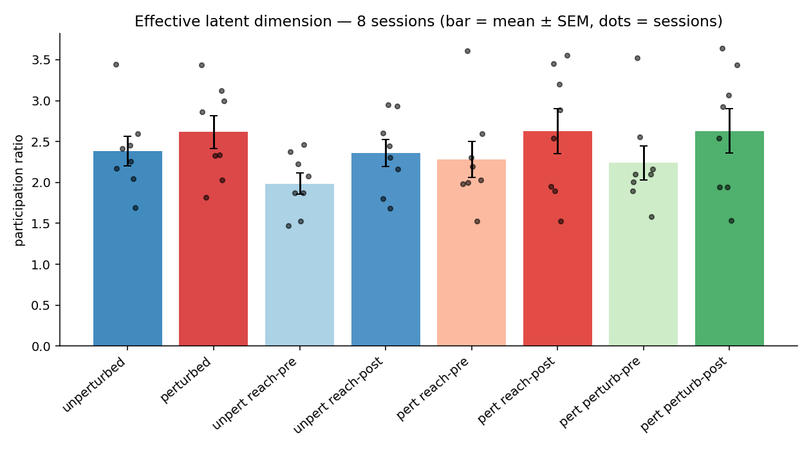

# Task B — effective dimensionality (participation ratio), all sessions

*Auto-generated by `run_taskB_all_sessions.py`.*

## Groups (8)
- **reach onset** = raw bin 48 (1.0 s), the *same frame for every trial* (latent index 48 − J); splits both unperturbed and perturbed trials.
- **perturbation onset** = per-trial first bin with u = 1 (perturbed only).
- PR = `(Σλ)²/Σλ²` of the latent covariance, equal-N trial bootstrap within each session; across sessions: mean ± SEM and paired Wilcoxon.



## Per-session participation ratio

| session | unperturbed | perturbed | unpert reach-pre | unpert reach-post | pert reach-pre | pert reach-post | pert perturb-pre | pert perturb-post |
|---|---|---|---|---|---|---|---|---|
| 0 | 2.26 | 2.33 | 2.08 | 2.95 | 1.99 | 3.20 | 2.01 | 3.06 |
| 1 | 2.41 | 3.00 | 1.52 | 2.60 | 1.53 | 3.45 | 1.58 | 3.43 |
| 2 | 2.17 | 3.13 | 1.87 | 2.16 | 2.19 | 2.89 | 2.10 | 2.93 |
| 3 | 3.44 | 3.44 | 2.23 | 2.93 | 3.61 | 2.54 | 3.52 | 2.54 |
| 4 | 1.70 | 2.03 | 1.47 | 1.69 | 2.31 | 1.90 | 2.16 | 1.94 |
| 5 | 2.59 | 2.86 | 2.37 | 2.45 | 2.03 | 3.55 | 1.89 | 3.64 |
| 6 | 2.45 | 2.34 | 2.47 | 2.30 | 2.60 | 1.95 | 2.56 | 1.95 |
| 7 | 2.05 | 1.82 | 1.88 | 1.80 | 2.00 | 1.53 | 2.10 | 1.53 |
| **mean±SEM** | 2.38±0.18 | 2.62±0.20 | 1.99±0.13 | 2.36±0.17 | 2.28±0.22 | 2.63±0.27 | 2.24±0.21 | 2.63±0.27 |

## Before/after contrasts across sessions (paired Wilcoxon, n = 8)

| contrast | pre (mean) | post (mean) | Δ | p (post>pre) | p (two-sided) |
|---|---|---|---|---|---|
| perturbed: reach post − pre | 2.28 | 2.63 | +0.35 | 0.191 | 0.383 |
| unperturbed: reach post − pre | 1.99 | 2.36 | +0.38 | 0.027 | 0.055 |
| perturbed: perturb post − pre | 2.24 | 2.63 | +0.39 | 0.191 | 0.383 |

## Perturbed vs unperturbed across sessions (paired Wilcoxon, n = 8)

| contrast | unpert (mean) | pert (mean) | Δ | p (pert>unpert) | p (two-sided) |
|---|---|---|---|---|---|
| post-reach: perturbed − unperturbed | 2.36 | 2.63 | +0.26 | 0.230 | 0.461 |
| pre-reach:  perturbed − unperturbed | 1.99 | 2.28 | +0.29 | 0.098 | 0.195 |
| whole trial: perturbed − unperturbed | 2.38 | 2.62 | +0.23 | 0.098 | 0.195 |

## Reach expansion: perturbed vs unperturbed (difference-of-differences)

Per-session reach effect (post − pre), perturbed vs unperturbed; paired Wilcoxon, n = 8. Tests whether the perturbation adds reach expansion *beyond* the reach itself.

| quantity | mean | p (pert>unpert) | p (two-sided) |
|---|---|---|---|
| perturbed reach (post − pre) | +0.35 | | |
| unperturbed reach (post − pre) | +0.38 | | |
| **difference (pert − unpert)** | -0.03 | **0.578** | 0.945 |

Session-wise reach effect and the paired difference:

| session | 0 | 1 | 2 | 3 | 4 | 5 | 6 | 7 |
|---|---|---|---|---|---|---|---|---|
| perturbed (post−pre) | +1.22 | +1.92 | +0.69 | -1.07 | -0.41 | +1.53 | -0.65 | -0.47 |
| unperturbed (post−pre) | +0.87 | +1.08 | +0.29 | +0.71 | +0.21 | +0.08 | -0.16 | -0.07 |
| **difference (pert−unpert)** | +0.35 | +0.84 | +0.40 | -1.78 | -0.62 | +1.45 | -0.49 | -0.40 |

```
difference (pert − unpert) per session = [+0.345, +0.845, +0.402, -1.777, -0.622, +1.451, -0.487, -0.398]
```

> The reach split is the same frame for all trials; the perturbation split is per-trial. Comparing the two reveals whether the dimensionality change is tied to the reach itself or specifically to the perturbation.

