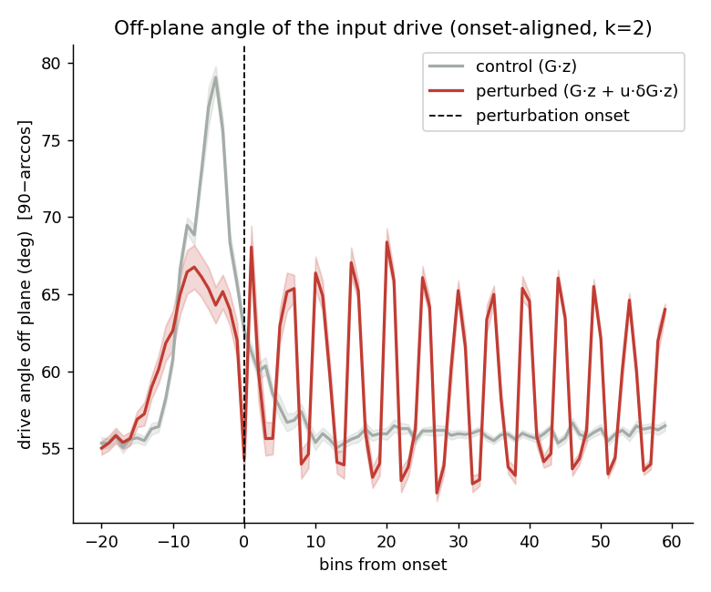
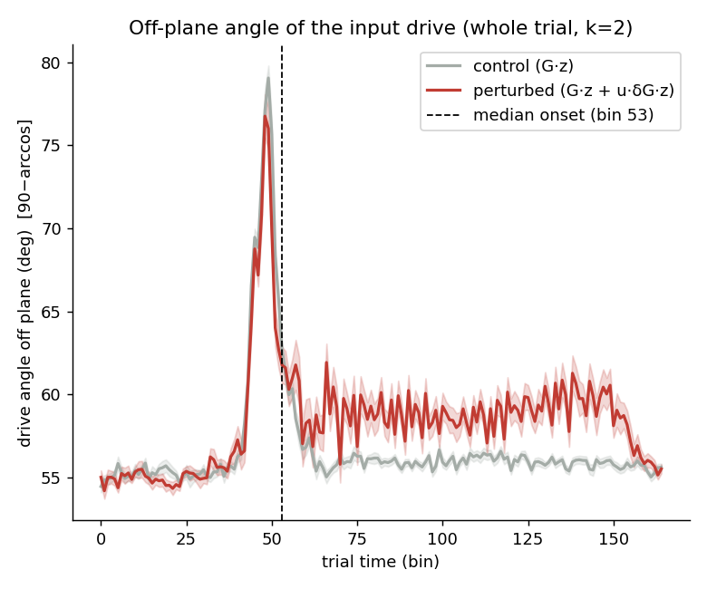
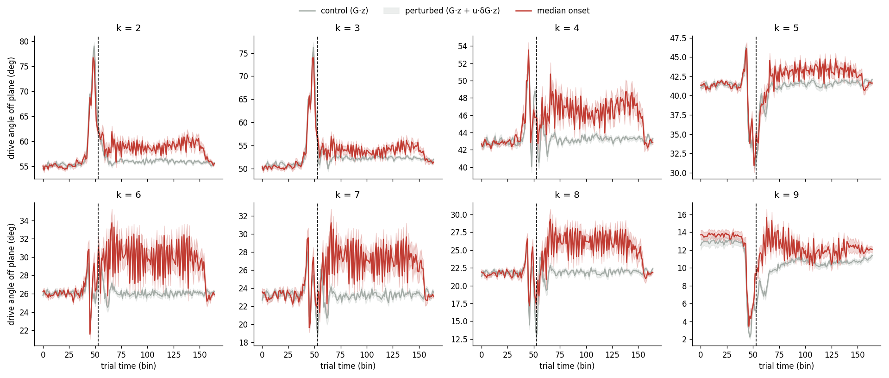
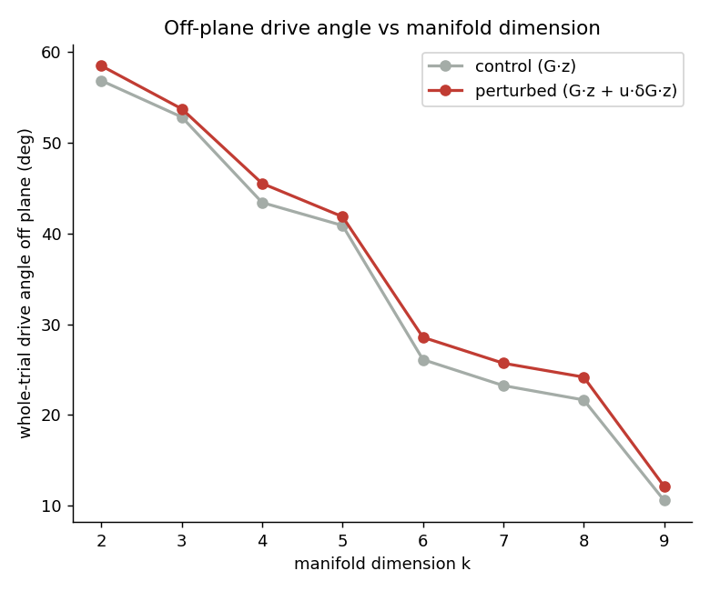

# Off-plane angle of the input drive — PLDS port of the calcium "Plot 2"

**Session 0, p = 10.** Reproduces the old calcium + ridge "Off-plane angle" figure
on the fitted PLDS. *Run via `run_taskA_drive_angle.py`; primitive
`manifold_analysis.direction_off_manifold_angle`.*

---

## 1. What the old test was

In the calcium analysis, the off-plane angle was computed not on the neural
*state* but on the instantaneous **input drive**:

- control drive  = `K0·z`  (= `G·z`, baseline kinematic drive)
- perturbed drive = `K0·z + u_t·K1·z`  (= `G·z + u_t·δG·z`, per-lag gated)

A 2-D plane was fit to the trial-averaged **control** trajectory; the angle of
each drive off that plane was `90 − arccos(|cos(drive, normal)|)`. Claim:
perturbed drive points further off the control plane than control drive.

## 2. How it ports to the PLDS

| calcium + ridge | PLDS |
|---|---|
| ambient = PCA-3 of neural data | latent `s ∈ R^10` (already denoised low-D; no neural PCA) |
| drive in neural space | drive in the **latent**: `Σ_l G_l z_{t-l}`, `Σ_l u_{t-l} δG_l z_{t-l}` (`realized_drive`) |
| plane = fit to mean control trajectory | manifold = top-k PCs of the **trial-averaged unperturbed latent trajectory** |
| single normal | the (p−k)-D orthogonal complement |
| `90 − arccos(\|cos\|)` | `degrees(arcsin(‖drive_⊥‖/‖drive‖))` — *identical* to `90 − arccos` when k = p−1 |

The manifold comes out **k = 2** (PC1 78%, PC1+2 93% of the mean-trajectory
variance) — a genuine plane, matching the original. (The pooled-state manifold
used elsewhere is k = 5; averaging over trials removes trial-to-trial variance,
which is why the *mean* trajectory is lower-dimensional.)

## 3. Results (k = 2 plane)

| | drive angle off plane | test | p |
|---|---|---|---|
| perturbed, post-onset | **59.2 ± 1.1°** | — | — |
| control (`G·z`) | **56.8 ± 0.5°** | perturbed > control (Mann–Whitney) | **3.6 × 10⁻²⁴** |
| perturbed, pre-onset | 61.0 ± 3.8° | post > pre within trial (Wilcoxon) | ≈ 1.0 (n.s.) |



`k`-sensitivity (same pattern; angles shrink as the plane grows):

```
k=2 :  ctrl 56.8   pre 61.0   post 59.2
k=3 :  ctrl 52.8   pre 56.5   post 54.4
k=5 :  ctrl 40.9   pre 39.7   post 41.9
```

## 4. What it means

- **The across-group direction reproduces the calcium result:** perturbed-trial
  drive points more off the unperturbed plane than control-trial drive, very
  significantly (p = 3.6 × 10⁻²⁴).
- **But the gap is a kinematic group difference, not a δG effect.** Perturbed
  *pre-onset* drive (61°, pure `G·z`, before `u·δG` fires) is already above
  control (57°), and post-onset (59°) is **not** higher than pre-onset. So the
  difference reflects perturbed trials having different kinematics `z` from
  control trials — present before the perturbation — not the perturbation gate.
- **Why δG doesn't show here** even though it is ~19% off-manifold in the
  counterfactual: this metric uses the **full** drive `G·z + u·δG·z`, which is
  dominated by the large `G·z` baseline, so adding `u·δG·z` barely rotates the
  total direction.

This is the **same trial-group confound the original two-group comparison had**,
ported faithfully. To isolate the perturbation's *causal* contribution, use the
δG-drive-alone angle or the within-trial counterfactual (see `validate_report.md`,
Test C).

## 4b. Whole-trial version (no onset alignment — closest to the old calcium plot)

Section 3 aligns each trial to *its own* perturbation onset (onset varies here,
bin 27–60). The old calcium experiment instead had the perturbation at a **fixed
frame**, so it simply plotted vs absolute trial time. To match that, this version
averages all trials at each **absolute trial-time bin** over the whole trial, with
no per-trial alignment (median onset, bin 53, drawn only as a reference line).

| | whole-trial drive angle off plane | test | p |
|---|---|---|---|
| perturbed (`G·z + u·δG·z`) | **58.5 ± 0.8°** | — | — |
| control (`G·z`) | **56.8 ± 0.5°** | perturbed > control (Mann–Whitney) | **5.8 × 10⁻²³** |



**Reading.** Same conclusion as the onset-aligned version, and even closer to the
old calcium figure: averaged over the whole trial, perturbed-trial drive is
significantly more off the unperturbed plane than control (p = 5.8 × 10⁻²³). The
gap (~1.6°) is slightly smaller than the onset-aligned post-onset gap because the
whole-trial average includes the pre-onset segment. The same caveat applies — the
separation is largely a kinematic trial-group difference, not specifically δG.

**Same time course across manifold dimensions.** The whole-trial plot above uses
`k=2`; below is the identical plot for `k=2…9`. The overall angle drops as `k`
grows (the manifold absorbs more baseline drive), but in every panel the
perturbed curve (red) stays above control (grey) and shows the same excursion
around the median onset.



## 4c. Robustness to manifold dimension `k` (whole trial)

The high baseline at `k=2` is just because a 2-D plane in 10-D latent space leaves
a large 8-D orthogonal complement. Growing `k` lets the manifold absorb more of
the baseline `G·z` drive, so the control angle should shrink — and it does. The
question is whether the **perturbed > control gap survives** a larger reference
subspace (i.e. is the perturbed excess real, or just an artifact of a cramped
plane?).

| k | manifold var% | control (baseline) | perturbed | gap |
|---|---|---|---|---|
| 2 | 93.0% | 56.8° | 58.5° | +1.6 |
| 3 | 96.3% | 52.8° | 53.7° | +0.9 |
| 4 | 98.1% | 43.4° | 45.5° | +2.1 |
| 5 | 99.2% | 40.9° | 41.8° | +1.0 |
| 6 | 99.6% | 26.1° | 28.6° | +2.5 |
| 7 | 99.7% | 23.2° | 25.7° | +2.5 |
| 8 | 99.9% | 21.7° | 24.2° | +2.5 |
| 9 | 100% | 10.6° | 12.2° | +1.6 |



**Reading.**
- **The baseline shrinks as expected:** control drops 56.8° → 10.6° as `k` goes
  2 → 9 (at `k=p` it would hit 0° trivially, the manifold becoming all of R¹⁰).
  So the large angles at low `k` were a geometric consequence of the small plane,
  not evidence of anything.
- **The perturbed > control gap survives at every `k`** (+0.9° to +2.5°, always
  positive). Even at `k=8`, where the manifold captures 99.9% of the unperturbed
  trajectory and the baseline is down to ~22°, perturbed is still +2.5° higher.
  So the perturbed excess is **not** manufactured by a cramped low-`k` plane —
  perturbed trials drive into directions the unperturbed manifold genuinely does
  not span, robustly across `k`.
- (The gap wobbles non-monotonically — +2.1 at k=4, +1.0 at k=5 — because *which*
  specific PC is added at each step changes the orthogonal complement; the trend,
  not the per-step jiggle, is what matters.)

The Section-4 caveat still holds (the gap mixes the δG effect with kinematic
group differences), but the `k`-robustness confirms the geometry is not an
artifact of the manifold-dimension choice.

## 5. Reproduce

```
/home/sp645/miniconda3/envs/ssm/bin/python run_taskA_drive_angle.py
# manifold dim: set MANIFOLD_K in the script (None = 90% var → k=2)
```
