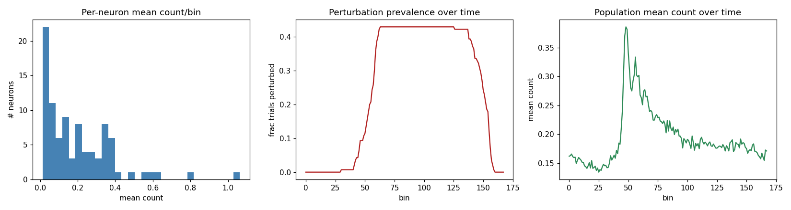
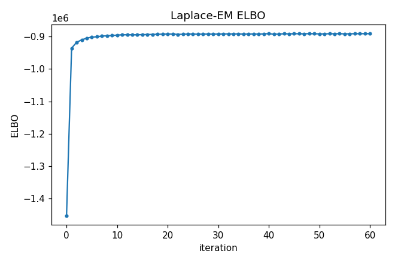
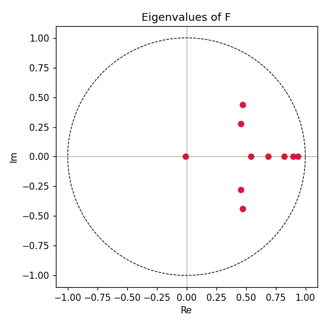
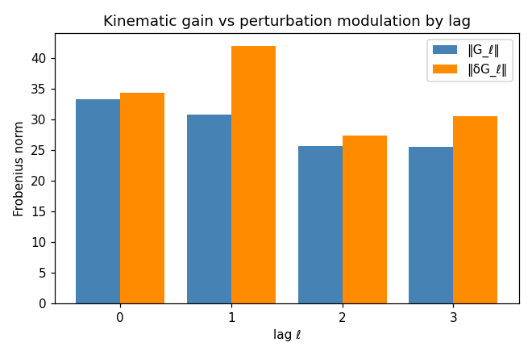
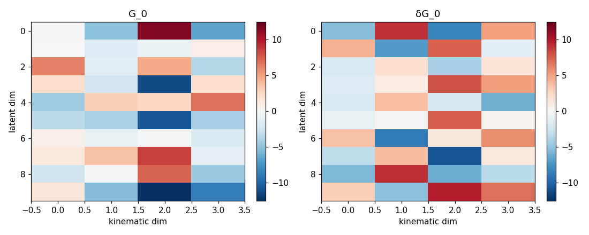
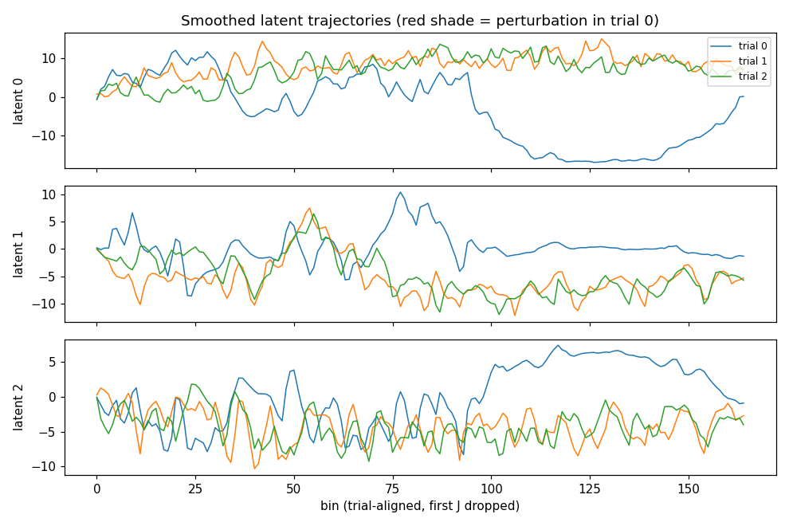
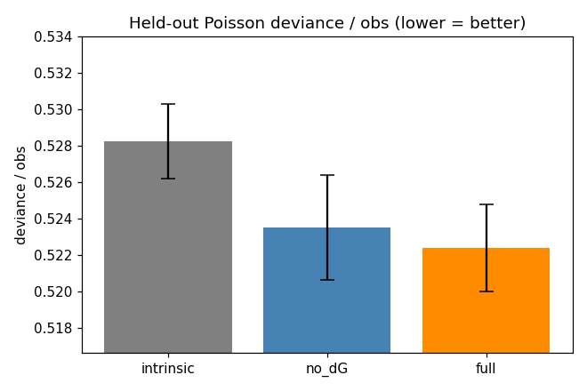

# Perturbation PLDS — session 0

*Generated 2026-06-03 14:20 by `run_session_analysis.py`.*

## 1. Data summary

- **Trials (N):** 140  |  **Bins/trial (T):** 168  |  **bin width Δ:** 20.83 ms
- **Kinematic dim d_z:** 4  (pos_x, pos_y, vel_x, vel_y)  — *note: real data has d_z=4, not the spec's 6; the model infers d_z automatically.*
- **Neuron / channel dim d_x:** 91

**Kinematics (Z)** — mean ± std per dim:

| dim | mean | std |
|-----|------|-----|
| pos_x | 0.631 | 0.211 |
| pos_y | 0.546 | 0.192 |
| vel_x | 0.002 | 0.033 |
| vel_y | 0.002 | 0.047 |

**Perturbation (U)** — binary {0,1}:
- fraction of all bins perturbed: **0.247**
- trials with any perturbation: **60/140**
- onset bin (within trial): min 30, median 56, max 63
- mean perturbed bins per perturbed trial: **96.8**

**Spike counts (X)** — Poisson observations:
- integer counts: True, range [0, 10]
- mean count/bin: **0.195**, fraction of zeros: **0.847**
- per-neuron mean count: min 0.0126, max 1.0635, neurons with zero total count: 0



## 2. Model fit

- **Latent dim p:** 10  |  **lag J:** 3  (input dim M = 2·(J+1)·d_z = 32)
- **Ridge:** lam_G = 0.001, lam_dG = 0.001, lam_F = 0
- **Laplace-EM:** 60 iters (+12 init), wall time 10.4 min
- **Final ELBO:** -890,620.5  (start -1,453,555.2, total ascent 562,934.7)
- **ELBO monotonicity:** max single-step drop 1353.79 (has dips)

**Dynamics eigenvalues |λ(F)|** (top 6):
`0.938, 0.899, 0.820, 0.687, 0.644, 0.644`
- spectral radius: **0.938** (stable)

### Kinematic gain G and perturbation modulation δG

Frobenius norm of each lag block (||·|| over the p×d_z matrix):

| lag ℓ | ‖G_ℓ‖ | ‖δG_ℓ‖ | ‖δG_ℓ‖/‖G_ℓ‖ |
|------|-------|--------|---------------|
| 0 | 33.257 | 34.385 | 1.034 |
| 1 | 30.748 | 41.997 | 1.366 |
| 2 | 25.660 | 27.406 | 1.068 |
| 3 | 25.526 | 30.537 | 1.196 |

- total ‖G‖ = 57.979, total ‖δG‖ = 68.042, overall ratio ‖δG‖/‖G‖ = 1.174

> ‖δG_ℓ‖ measures how strongly the perturbation **re-weights** the way lagged kinematics drive the latent neural state. A non-trivial ratio is the first (in-sample) sign that the perturbation gates kinematic input; cross-validation (section 3) tests whether this is real or overfitting.







### In-sample one-step-ahead prediction

- Poisson deviance / obs: **0.5139**
- pseudo-R² (vs constant-rate null): **0.1732**
- log-likelihood: -880,673.5 over 2,089,360 observations

## 3. Cross-validation: are G and δG real?

Trial-level k-fold CV (folds split by **trial**, never by bin). Three nested models share the same Laplace-EM budget; lower held-out Poisson deviance/obs is better.

- **full** : latent + lagged kinematics G + perturbation-gated δG
- **no_dG** : latent + lagged kinematics G only (δG ≡ 0)
- **intrinsic** : latent dynamics only (no kinematic input)

*(3 folds, 25 iters/fit, wall time 31.9 min)*

| model | held-out deviance/obs (mean ± std) | pseudo-R² | held-out ELBO |
|-------|-----------------------------------|-----------|------------|
| intrinsic | 0.5282 ± 0.0020 | 0.1497 | -300,589 |
| no_dG | 0.5235 ± 0.0029 | 0.1573 | -298,560 |
| full | 0.5224 ± 0.0024 | 0.1591 | -298,363 |

### Verdict

- **G (kinematics) helps?** intrinsic − no_dG = `+0.0047` deviance/obs → **YES** (kinematics improve held-out prediction).
- **δG (perturbation gating) helps?** no_dG − full = `+0.0011` deviance/obs → **YES** (perturbation-gated kinematics improve held-out prediction beyond plain kinematics).

> The δG comparison is the key scientific test: if **full** beats **no_dG** out of sample, the proprioceptive perturbation genuinely changes how kinematics drive the latent neural state (δG ≠ 0), not merely as an in-sample artifact.



---

## Configuration

```
session = 0
window = 168
p = 10
J = 3
lam_G = 0.001
lam_dG = 0.001
lam_F = 0.0
n_iters = 60
num_init_iters = 12
n_folds = 3
cv_n_iters = 25
cv_num_init_iters = 6
no_cv = False
outdir = None
```
