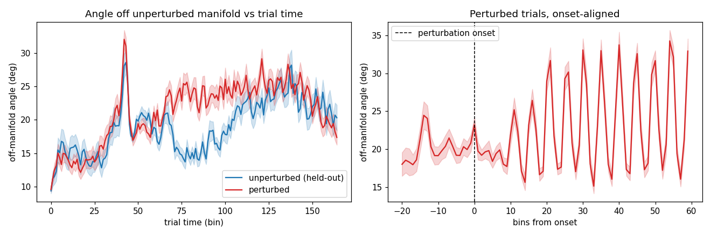
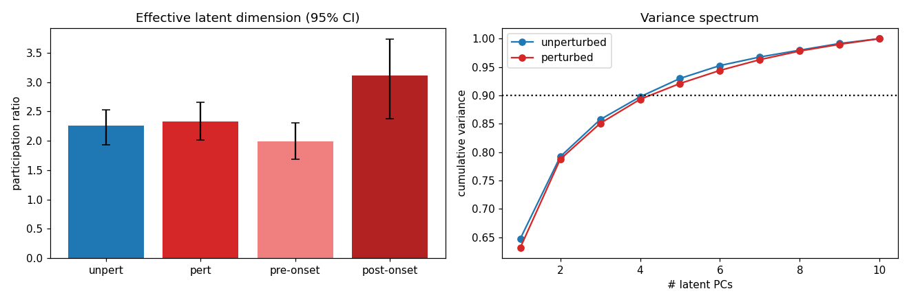
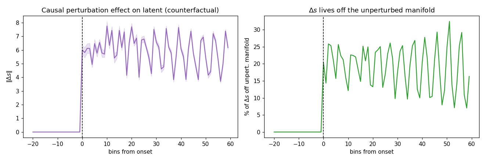

# Does the perturbation push neural activity into a higher-dimensional space?

**Validation of the perturbation PLDS latent — session 0 (p = 10).**
*Generated from `validate_fit_results.ipynb` (regenerate via `build_validate_nb.py`); fit cached in `fit_p10.pkl` (`fit_p10_cache.py`).*

---

## 1. Background and goal

In the earlier **calcium + ridge-regression** analysis we found that:

> Unperturbed neural trajectories, after PCA, stay on a low-dimensional plane.
> Perturbed trajectories *leave* that plane — the angle between the trajectory and
> the plane is larger for perturbed trials at every time step.

The goal here is to test whether the **same phenomenon survives in the fitted
PLDS**, and to restate it as the cleaner claim *"perturbed activity needs a
higher-dimensional space"* (no 2-plane assumption required).

### Why the PLDS lets us say more

The PLDS gives us, per trial, a denoised low-dimensional latent state `s_t ∈ R^p`
— this is the model's analog of "calcium after PCA". Crucially, the perturbation
`u` enters the latent **only** through the gated gain `δG`:

```
s_t = F s_{t-1} + Σ_ℓ G_ℓ z_{t-ℓ}  +  u_{t-ℓ}·Σ_ℓ δG_ℓ z_{t-ℓ}  +  m_s + noise
                 └── baseline kinematic drive ──┘   └── perturbation-only drive ──┘
x_t ~ Poisson(Δ · exp(C s_t + b))
```

So `δG` is the *only channel* by which the perturbation can move the latent. That
means we can not only re-show the correlational result, but also run a
**counterfactual** that isolates the perturbation's causal effect — something the
calcium ridge regression could not do.

### Setup

- **140 trials**: 60 perturbed, 80 unperturbed; latent length T−J = 165 bins.
- **Latent dimension p = 10** (chosen over the p=5 notebook fit so there is *room*
  for extra dimensions to appear — at p=5 the model is too cramped to express
  them, which would confound a null result with a capacity limit).
- Perturbation onset varies per trial (median bin 53); all peri-onset analyses
  are **aligned to onset**, not to trial start.

---

## 2. Test A — Off-manifold angle (direct replica of the calcium figure)

**What it tests.** Whether perturbed latents leave the manifold occupied by
unperturbed activity, time step by time step.

**How.**
1. Build the **unperturbed manifold** from a *training half* of unperturbed trials:
   the top-k principal components capturing 90% of their latent variance
   (here **k = 5** of the 10 latent dims).
2. For every state `s_t`, measure the angle off that manifold,
   `θ_t = arcsin(‖s⊥‖ / ‖s‖)` (0° = on-manifold, 90° = fully orthogonal).
3. Evaluate on **held-out** unperturbed trials (guards against circularity — they
   should stay *on*-manifold) versus perturbed trials.

**Results.**

| comparison | angle | test | p-value |
|---|---|---|---|
| perturbed, post-onset | **22.75 ± 2.56°** | — | — |
| unperturbed (held-out) | **19.00 ± 2.24°** | perturbed > unperturbed (Mann–Whitney) | **1.5 × 10⁻¹⁰** |
| perturbed, pre-onset | 20.07 ± 5.62° | post > pre within trial (Wilcoxon) | **8.1 × 10⁻⁴** |



**What it means.** The calcium result holds: perturbed latents sit reliably
*further off* the unperturbed manifold, both compared to unperturbed trials and
compared to their own pre-onset baseline. The onset-aligned panel (right) shows a
clean step up exactly at perturbation onset. The effect is **moderate in size
(~3–4°) but extremely reliable** (p ≈ 10⁻¹⁰).

---

## 3. Test B — Effective dimensionality ("needs a higher-dimensional space")

**What it tests.** Whether perturbed activity occupies *more* latent dimensions —
the dimensionality restatement of the calcium claim.

**How.** The **participation ratio** `PR = (Σλ)² / Σλ²` of the latent covariance
(λ = eigenvalues). PR is the *effective* number of dimensions and is
**scale-invariant** — a larger response is not mistaken for a higher-dimensional
one. Compared at **equal trial count** via bootstrap (95% CIs). Two contrasts:
(i) perturbed vs unperturbed trials, and (ii) pre- vs post-onset **within**
perturbed trials (controls for trial identity and overall behavior).

**Results.**

| condition | participation ratio (95% CI) |
|---|---|
| unperturbed | 2.26 [1.93, 2.53] |
| perturbed (whole trial) | 2.33 [2.01, 2.66] |
| perturbed, **pre-onset** | **1.99 [1.68, 2.31]** |
| perturbed, **post-onset** | **3.11 [2.38, 3.74]** |

Fraction of perturbed-trial variance lying **outside** the unperturbed 5-D
manifold: **9.0%**.



**What it means.** The dimensional expansion is **real but onset-locked, not a
whole-trial property**:

- Comparing whole perturbed vs whole unperturbed trials shows **no difference**
  (2.33 vs 2.26, CIs overlap) — averaging over the whole trial washes the effect
  out, because perturbed trials spend a long pre-onset segment at baseline.
- The signal appears once you align to onset: **within perturbed trials the
  effective dimension jumps from ~2.0 (pre) to ~3.1 (post)**, i.e. the
  perturbation transiently recruits roughly one extra effective dimension.

> **Honest framing:** state this as *"the perturbation transiently expands latent
> dimensionality"*, **not** *"perturbed trials are globally higher-dimensional."*
> The alignment to onset is essential.

---

## 4. Test C — Mechanism: the extra dimensions are *caused* by δG

**What it tests.** Whether the dimensional expansion is **caused** by the
perturbation gate `δG`, rather than being a by-product of perturbed trials simply
having different kinematics.

**How — counterfactual simulation.** For each perturbed trial, roll the mean
latent dynamics forward **twice** with the *same* kinematics `z` and the *same*
initial state `s_0`, changing only whether the perturbation is on:

```
s_on  : perturbation active  (δG drive on)
s_off : perturbation off      (δG drive zeroed)
Δs = s_on − s_off            ← pure causal effect of the perturbation
```

Because behavior is held fixed, `Δs` isolates exactly what `δG` does. We then ask
how big `Δs` is and how much of it lies *off* the unperturbed manifold.

(Note: the *raw column space* of `δG` is uninformative here — with p = 10 < (J+1)·d_z = 16
it fills all of R^p — so we use the counterfactual and the data-weighted
"realized drive" instead.)

**Results.**

| quantity | value |
|---|---|
| ‖Δs‖ pre-onset | **0.000** (exactly zero — u = 0 ⇒ no δG drive) |
| ‖Δs‖ post-onset | **5.945** |
| fraction of Δs off the unperturbed manifold (post-onset) | **19.1%** |
| realized δG drive off the unperturbed manifold | **19.1%** |
| participation ratio of Δs (its own effective dim) | **2.20** |



**What it means.** The perturbation's causal effect on the latent is **exactly
zero before onset** (by construction) and grows immediately after, with **~19% of
it pointing into directions the unperturbed dynamics never use**, spanning ~2
effective dimensions. The independently-computed realized `δG` drive lands the
same 19% off-manifold. This is a **causal** statement: the proprioceptive
perturbation gates kinematic input into new latent directions — not merely a
correlation between perturbation and off-manifold activity.

---

## 5. Overall conclusion

The calcium "perturbed activity leaves the low-D plane" result **holds on the
PLDS, and is upgraded to a mechanistic, causal account**:

1. **Escape (A).** Perturbed latents leave the unperturbed manifold at every
   post-onset time step (22.8° vs 19.0°, p = 1.5 × 10⁻¹⁰; post > pre, p = 8 × 10⁻⁴).
2. **Higher dimension (B).** Effective latent dimension rises from ~2.0 to ~3.1
   across onset; 9% of perturbed variance lies off the unperturbed 5-D manifold.
3. **Caused by δG (C).** A behavior-matched counterfactual shows the effect is
   produced specifically by the learned `δG` gate, with ~19% of it off-manifold.

**Key caveat.** Effect sizes are modest and the expansion is **onset-locked** —
whole-trial averages show nothing, so onset alignment is mandatory.

**Next steps.** Repeat across sessions; check robustness to the latent dimension
`p` (e.g. 8, 12) and manifold dimension `k`; add a label-permutation null for the
angle and PR gaps.

---

## Reproduce

```
python fit_p10_cache.py          # ~12 min -> perturbation_plds_results/session0/fit_p10.pkl
python build_validate_nb.py      # regenerate validate_fit_results.ipynb
# execute the notebook with the ssm kernel (see ssm-notebook-execution note)
```
