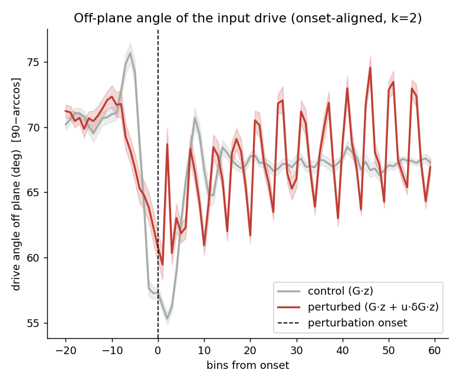
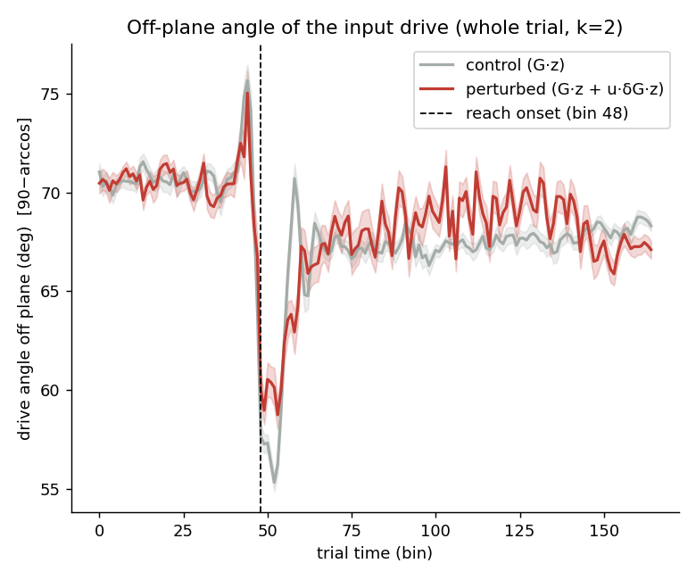
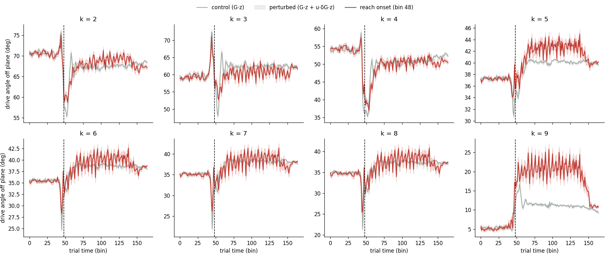
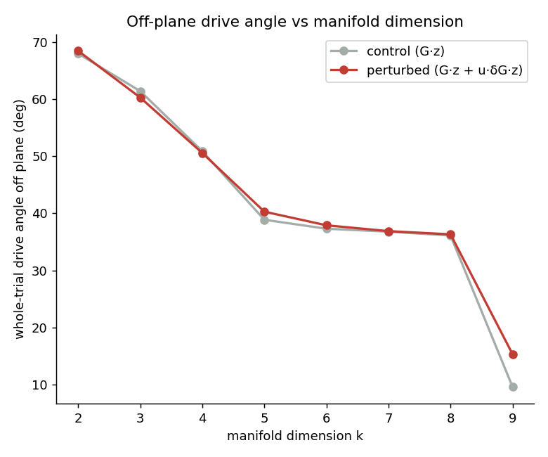

# Off-plane angle of the input drive (calcium Plot 2) — session 1

*Auto-generated by `run_all_sessions.py`. Drive: control = G·z, perturbed = G·z + u·δG·z; angle off plane = `90−arccos` = `arcsin(‖v⊥‖/‖v‖)`. Manifold = trial-averaged unperturbed latent trajectory, **k = 2** of p = 10.*

## Onset-aligned (k = 2)

| | drive angle off plane | p |
|---|---|---|
| perturbed, post-onset | 67.07 ± 1.03° | — |
| control (G·z) | 67.97 ± 0.56° | perturbed>control: **1.000** |
| perturbed, pre-onset | 69.26 ± 3.08° | post>pre: **1.000** |

## Whole trial — no onset alignment (closest to the old calcium plot)

| | whole-trial drive angle off plane | p |
|---|---|---|
| perturbed (G·z + u·δG·z) | 68.45 ± 0.73° | perturbed>control: **3.21e-06** |
| control (G·z) | 67.97 ± 0.56° | |

Per-k whole-trial time courses:

## Robustness to manifold dimension k (whole trial)

| k | manifold var% | control | perturbed | gap |
|---|---|---|---|---|
| 2 | 90.5% | 68.0° | 68.5° | +0.5 |
| 3 | 95.7% | 61.4° | 60.3° | -1.1 |
| 4 | 98.5% | 50.9° | 50.6° | -0.3 |
| 5 | 99.2% | 38.9° | 40.3° | +1.4 |
| 6 | 99.5% | 37.3° | 37.9° | +0.6 |
| 7 | 99.7% | 36.8° | 36.9° | +0.1 |
| 8 | 99.9% | 36.1° | 36.3° | +0.2 |
| 9 | 100.0% | 9.6° | 15.3° | +5.7 |

> The control baseline shrinks as k grows (the manifold absorbs more of the G·z drive), but the perturbed>control gap persists across k. The gap mixes the δG effect with kinematic trial-group differences; see `validate_report.md` Test C for the δG-isolating counterfactual.

