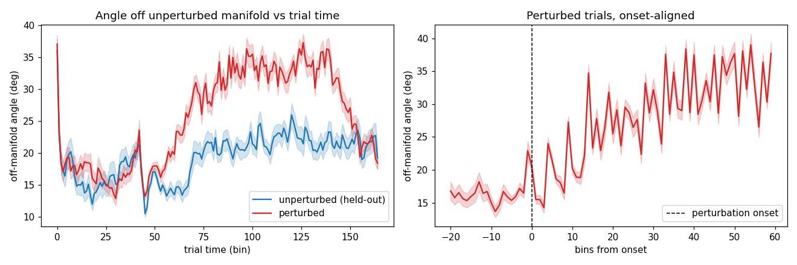
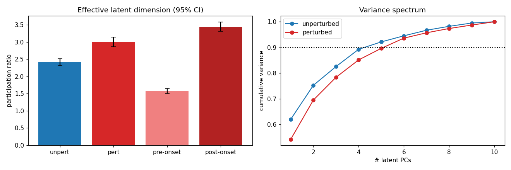
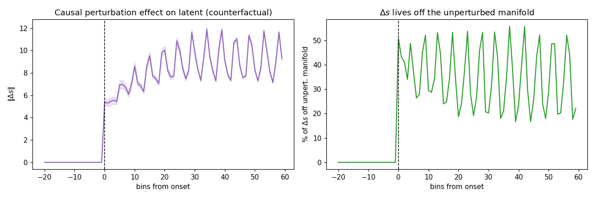

# Validation of the perturbation PLDS latent — session 1 (p = 10)

*Auto-generated by `run_all_sessions.py`. Fit cached in `fit_p10.pkl`; figures `validate_A/B/C_*.png`.*

## Setup
- **140 trials**: 60 perturbed, 80 unperturbed; latent dim **p = 10**, lag J = 3.
- Unperturbed manifold dimension (90% var, train half): **k = 5**.
- Median perturbation onset (trimmed): bin 50; final ELBO -1,416,516.

## A. Off-manifold angle (perturbed leaves the unperturbed manifold)

Angle of each latent state off the held-out unperturbed manifold (`arcsin(‖s⊥‖/‖s‖)`), onset-aligned.

| comparison | angle | p |
|---|---|---|
| perturbed, post-onset | 28.29 ± 3.03° | — |
| unperturbed (held-out) | 19.35 ± 1.86° | perturbed>unpert: **3.27e-17** |
| perturbed, pre-onset | 16.37 ± 3.68° | post>pre: **8.15e-12** |

## B. Effective dimensionality (participation ratio)

`PR = (Σλ)²/Σλ²` of the latent covariance, equal-N bootstrap (95% CI). Key contrast is pre- vs post-onset *within* perturbed trials.

| condition | participation ratio (95% CI) |
|---|---|
| unperturbed | 2.41 [2.31, 2.52] |
| perturbed (whole trial) | 3.00 [2.87, 3.14] |
| perturbed, **pre-onset** | 1.58 [1.51, 1.65] |
| perturbed, **post-onset** | 3.44 [3.31, 3.58] |

Fraction of perturbed variance outside the 5-D manifold: **16.1%**.

## C. Mechanism — counterfactual (δG-on vs δG-off, kinematics fixed)

| quantity | value |
|---|---|
| ‖Δs‖ pre-onset | 0.000 (≈0 by construction) |
| ‖Δs‖ post-onset | 8.443 |
| Δs off manifold (post) | 34.9% |
| realized δG drive off manifold | 38.9% |
| participation ratio of Δs | 2.76 |

> Onset alignment is essential: whole-trial averages dilute the effect; the dimensional expansion is transient and onset-locked.

