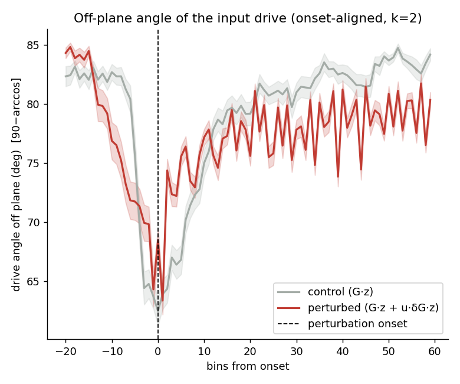
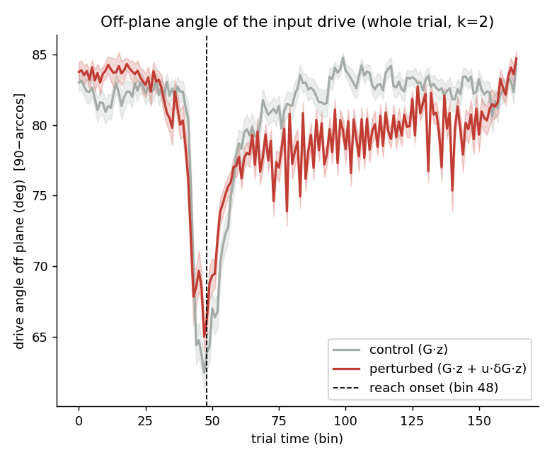
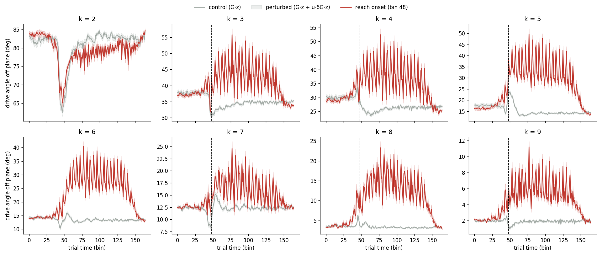
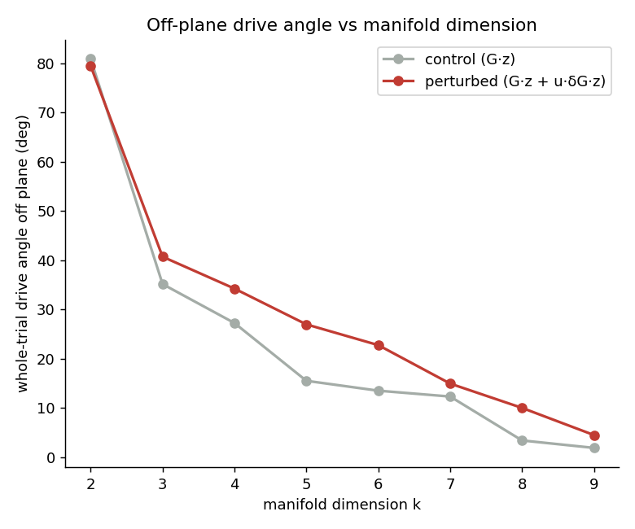

# Off-plane angle of the input drive (calcium Plot 2) — session 2

*Auto-generated by `run_all_sessions.py`. Drive: control = G·z, perturbed = G·z + u·δG·z; angle off plane = `90−arccos` = `arcsin(‖v⊥‖/‖v‖)`. Manifold = trial-averaged unperturbed latent trajectory, **k = 2** of p = 10.*

## Onset-aligned (k = 2)

| | drive angle off plane | p |
|---|---|---|
| perturbed, post-onset | 77.27 ± 1.70° | — |
| control (G·z) | 80.87 ± 1.56° | perturbed>control: **1.000** |
| perturbed, pre-onset | nan ± nan° | post>pre: **nan** |

## Whole trial — no onset alignment (closest to the old calcium plot)

| | whole-trial drive angle off plane | p |
|---|---|---|
| perturbed (G·z + u·δG·z) | 79.44 ± 1.33° | perturbed>control: **1.000** |
| control (G·z) | 80.87 ± 1.56° | |

Per-k whole-trial time courses:

## Robustness to manifold dimension k (whole trial)

| k | manifold var% | control | perturbed | gap |
|---|---|---|---|---|
| 2 | 98.0% | 80.9° | 79.4° | -1.4 |
| 3 | 99.0% | 35.2° | 40.7° | +5.6 |
| 4 | 99.7% | 27.3° | 34.2° | +7.0 |
| 5 | 99.9% | 15.5° | 27.0° | +11.5 |
| 6 | 99.9% | 13.5° | 22.8° | +9.3 |
| 7 | 100.0% | 12.3° | 15.0° | +2.6 |
| 8 | 100.0% | 3.4° | 10.0° | +6.6 |
| 9 | 100.0% | 1.9° | 4.5° | +2.6 |

> The control baseline shrinks as k grows (the manifold absorbs more of the G·z drive), but the perturbed>control gap persists across k. The gap mixes the δG effect with kinematic trial-group differences; see `validate_report.md` Test C for the δG-isolating counterfactual.

