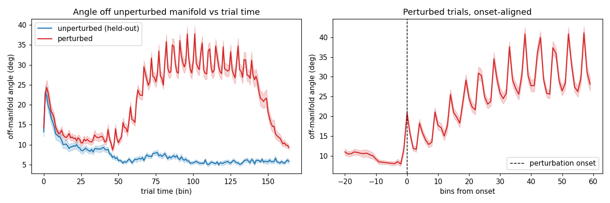
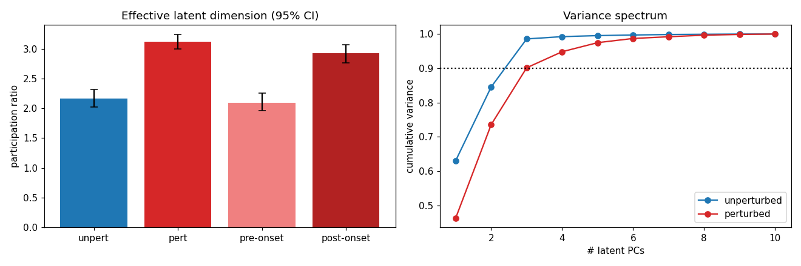
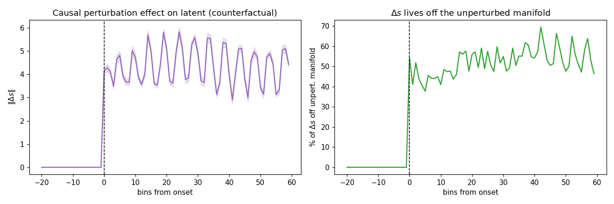

# Validation of the perturbation PLDS latent — session 2 (p = 10)

*Auto-generated by `run_all_sessions.py`. Fit cached in `fit_p10.pkl`; figures `validate_A/B/C_*.png`.*

## Setup
- **141 trials**: 60 perturbed, 81 unperturbed; latent dim **p = 10**, lag J = 3.
- Unperturbed manifold dimension (90% var, train half): **k = 3**.
- Median perturbation onset (trimmed): bin 47; final ELBO -277,685.

## A. Off-manifold angle (perturbed leaves the unperturbed manifold)

Angle of each latent state off the held-out unperturbed manifold (`arcsin(‖s⊥‖/‖s‖)`), onset-aligned.

| comparison | angle | p |
|---|---|---|
| perturbed, post-onset | 25.84 ± 6.40° | — |
| unperturbed (held-out) | 7.43 ± 1.63° | perturbed>unpert: **9.84e-18** |
| perturbed, pre-onset | nan ± nan° | post>pre: **nan** |

## B. Effective dimensionality (participation ratio)

`PR = (Σλ)²/Σλ²` of the latent covariance, equal-N bootstrap (95% CI). Key contrast is pre- vs post-onset *within* perturbed trials.

| condition | participation ratio (95% CI) |
|---|---|
| unperturbed | 2.17 [2.03, 2.32] |
| perturbed (whole trial) | 3.13 [3.00, 3.24] |
| perturbed, **pre-onset** | 2.10 [1.97, 2.26] |
| perturbed, **post-onset** | 2.93 [2.77, 3.07] |

Fraction of perturbed variance outside the 3-D manifold: **11.9%**.

## C. Mechanism — counterfactual (δG-on vs δG-off, kinematics fixed)

| quantity | value |
|---|---|
| ‖Δs‖ pre-onset | 0.000 (≈0 by construction) |
| ‖Δs‖ post-onset | 4.362 |
| Δs off manifold (post) | 52.4% |
| realized δG drive off manifold | 71.2% |
| participation ratio of Δs | 3.16 |

> Onset alignment is essential: whole-trial averages dilute the effect; the dimensional expansion is transient and onset-locked.

