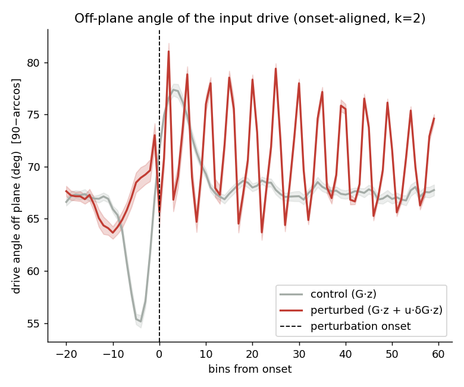
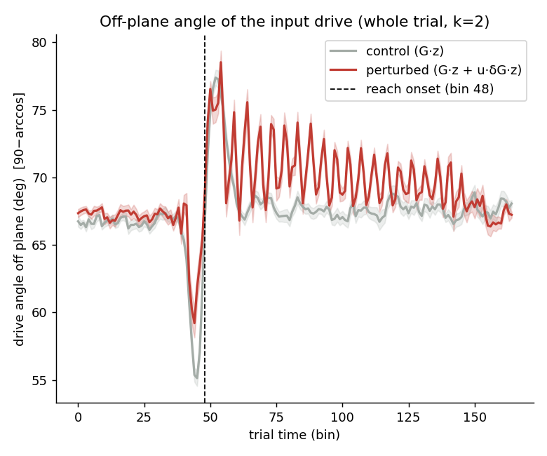
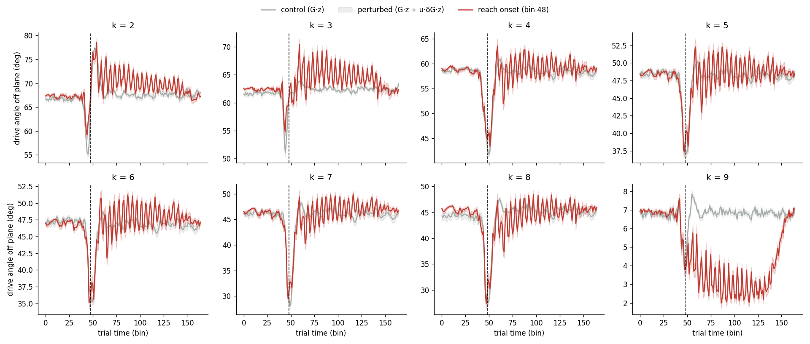
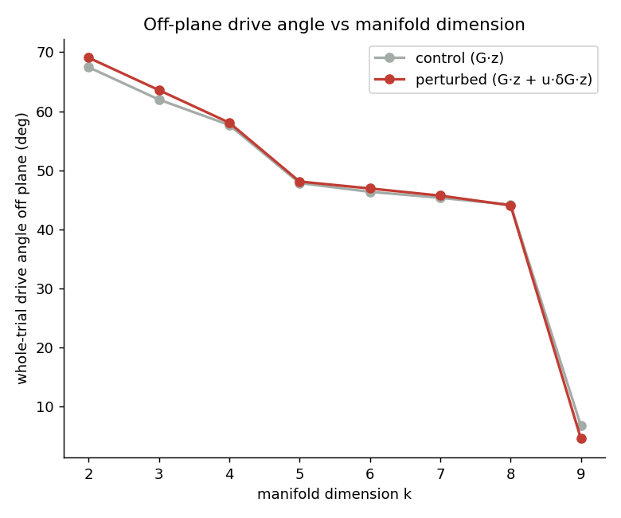

# Off-plane angle of the input drive (calcium Plot 2) — session 3

*Auto-generated by `run_all_sessions.py`. Drive: control = G·z, perturbed = G·z + u·δG·z; angle off plane = `90−arccos` = `arcsin(‖v⊥‖/‖v‖)`. Manifold = trial-averaged unperturbed latent trajectory, **k = 2** of p = 10.*

## Onset-aligned (k = 2)

| | drive angle off plane | p |
|---|---|---|
| perturbed, post-onset | 71.00 ± 0.63° | — |
| control (G·z) | 67.44 ± 0.57° | perturbed>control: **2.66e-24** |
| perturbed, pre-onset | 66.91 ± 1.81° | post>pre: **9.02e-12** |

## Whole trial — no onset alignment (closest to the old calcium plot)

| | whole-trial drive angle off plane | p |
|---|---|---|
| perturbed (G·z + u·δG·z) | 69.05 ± 0.53° | perturbed>control: **3.74e-22** |
| control (G·z) | 67.44 ± 0.57° | |

Per-k whole-trial time courses:

## Robustness to manifold dimension k (whole trial)

| k | manifold var% | control | perturbed | gap |
|---|---|---|---|---|
| 2 | 94.1% | 67.4° | 69.0° | +1.6 |
| 3 | 98.4% | 62.0° | 63.6° | +1.6 |
| 4 | 99.4% | 57.7° | 58.0° | +0.4 |
| 5 | 99.8% | 47.8° | 48.1° | +0.3 |
| 6 | 99.9% | 46.4° | 46.9° | +0.6 |
| 7 | 99.9% | 45.3° | 45.7° | +0.4 |
| 8 | 100.0% | 44.2° | 44.1° | -0.1 |
| 9 | 100.0% | 6.7° | 4.6° | -2.2 |

> The control baseline shrinks as k grows (the manifold absorbs more of the G·z drive), but the perturbed>control gap persists across k. The gap mixes the δG effect with kinematic trial-group differences; see `validate_report.md` Test C for the δG-isolating counterfactual.

