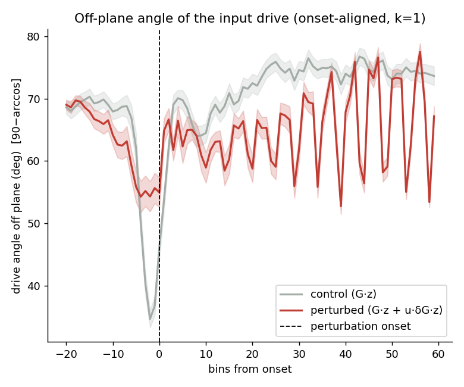
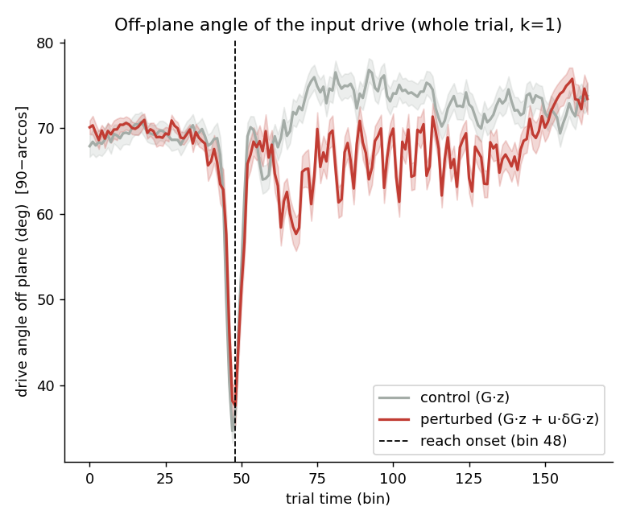
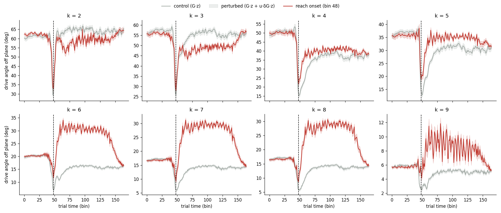
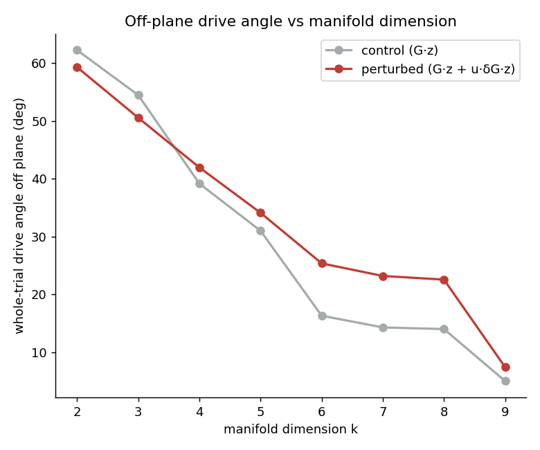

# Off-plane angle of the input drive (calcium Plot 2) — session 4

*Auto-generated by `run_all_sessions.py`. Drive: control = G·z, perturbed = G·z + u·δG·z; angle off plane = `90−arccos` = `arcsin(‖v⊥‖/‖v‖)`. Manifold = trial-averaged unperturbed latent trajectory, **k = 1** of p = 10.*

## Onset-aligned (k = 1)

| | drive angle off plane | p |
|---|---|---|
| perturbed, post-onset | 64.89 ± 3.91° | — |
| control (G·z) | 70.46 ± 8.12° | perturbed>control: **1.000** |
| perturbed, pre-onset | 63.30 ± 5.82° | post>pre: **0.055** |

## Whole trial — no onset alignment (closest to the old calcium plot)

| | whole-trial drive angle off plane | p |
|---|---|---|
| perturbed (G·z + u·δG·z) | 66.87 ± 3.21° | perturbed>control: **1.000** |
| control (G·z) | 70.46 ± 8.12° | |

Per-k whole-trial time courses:

## Robustness to manifold dimension k (whole trial)

| k | manifold var% | control | perturbed | gap |
|---|---|---|---|---|
| 2 | 98.5% | 62.2° | 59.3° | -3.0 |
| 3 | 99.5% | 54.4° | 50.5° | -3.9 |
| 4 | 99.8% | 39.2° | 41.9° | +2.8 |
| 5 | 100.0% | 31.0° | 34.1° | +3.1 |
| 6 | 100.0% | 16.3° | 25.4° | +9.0 |
| 7 | 100.0% | 14.3° | 23.2° | +8.9 |
| 8 | 100.0% | 14.0° | 22.6° | +8.5 |
| 9 | 100.0% | 5.0° | 7.4° | +2.4 |

> The control baseline shrinks as k grows (the manifold absorbs more of the G·z drive), but the perturbed>control gap persists across k. The gap mixes the δG effect with kinematic trial-group differences; see `validate_report.md` Test C for the δG-isolating counterfactual.

