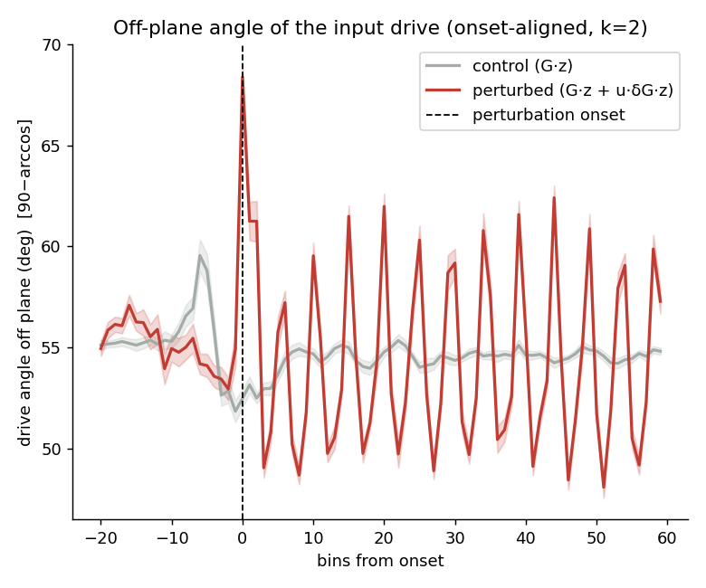
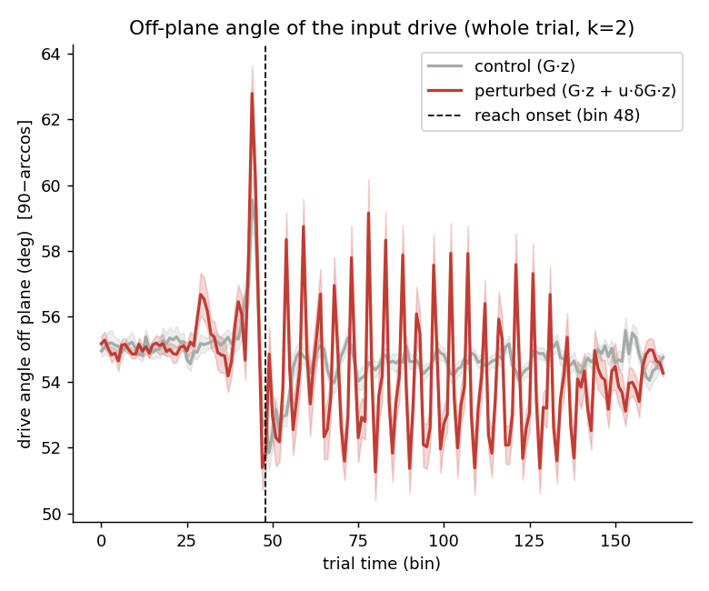
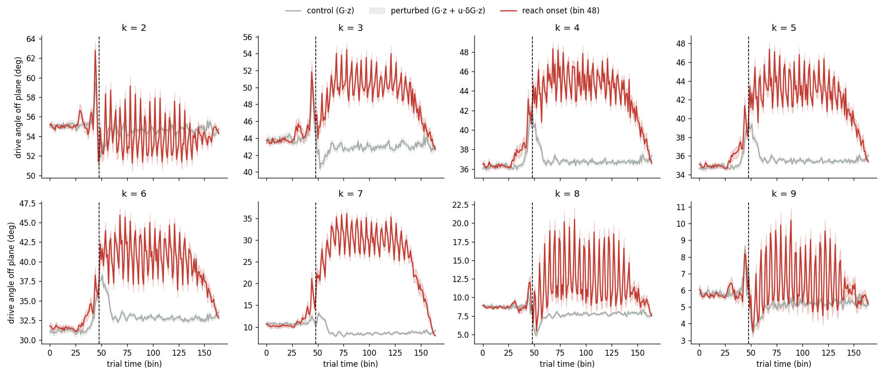
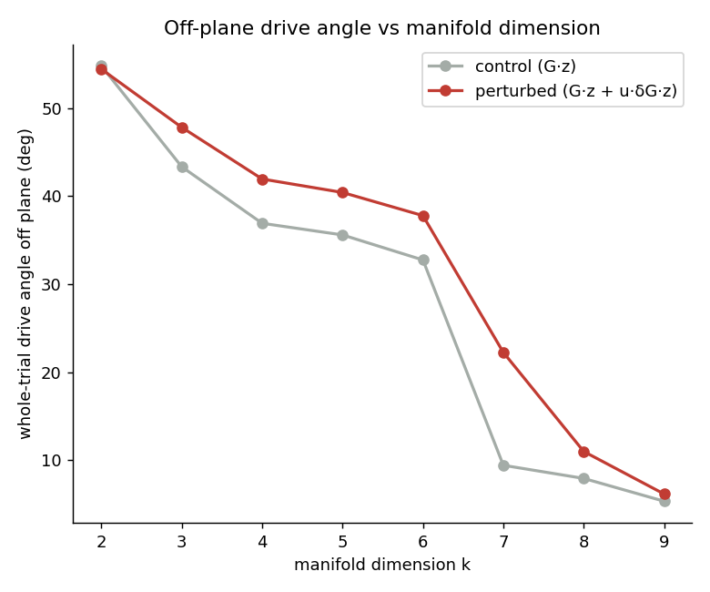

# Off-plane angle of the input drive (calcium Plot 2) — session 5

*Auto-generated by `run_all_sessions.py`. Drive: control = G·z, perturbed = G·z + u·δG·z; angle off plane = `90−arccos` = `arcsin(‖v⊥‖/‖v‖)`. Manifold = trial-averaged unperturbed latent trajectory, **k = 2** of p = 10.*

## Onset-aligned (k = 2)

| | drive angle off plane | p |
|---|---|---|
| perturbed, post-onset | 54.46 ± 0.88° | — |
| control (G·z) | 54.77 ± 0.32° | perturbed>control: **1.000** |
| perturbed, pre-onset | nan ± nan° | post>pre: **nan** |

## Whole trial — no onset alignment (closest to the old calcium plot)

| | whole-trial drive angle off plane | p |
|---|---|---|
| perturbed (G·z + u·δG·z) | 54.41 ± 0.62° | perturbed>control: **1.000** |
| control (G·z) | 54.77 ± 0.32° | |

Per-k whole-trial time courses:

## Robustness to manifold dimension k (whole trial)

| k | manifold var% | control | perturbed | gap |
|---|---|---|---|---|
| 2 | 91.9% | 54.8° | 54.4° | -0.4 |
| 3 | 98.4% | 43.3° | 47.8° | +4.5 |
| 4 | 99.4% | 36.9° | 41.9° | +5.0 |
| 5 | 99.7% | 35.6° | 40.4° | +4.8 |
| 6 | 99.8% | 32.7° | 37.8° | +5.0 |
| 7 | 100.0% | 9.4° | 22.3° | +12.8 |
| 8 | 100.0% | 8.0° | 11.0° | +3.1 |
| 9 | 100.0% | 5.4° | 6.2° | +0.8 |

> The control baseline shrinks as k grows (the manifold absorbs more of the G·z drive), but the perturbed>control gap persists across k. The gap mixes the δG effect with kinematic trial-group differences; see `validate_report.md` Test C for the δG-isolating counterfactual.

