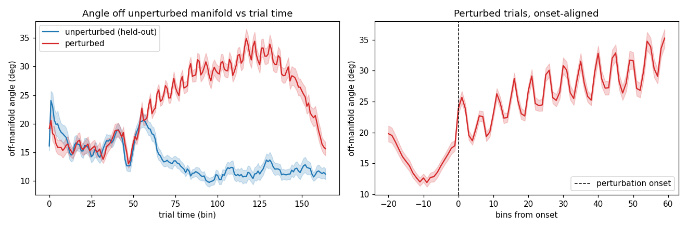
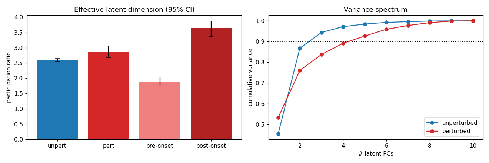
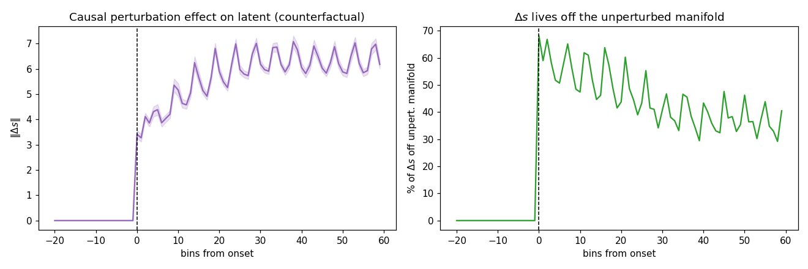

# Validation of the perturbation PLDS latent — session 5 (p = 10)

*Auto-generated by `run_all_sessions.py`. Fit cached in `fit_p10.pkl`; figures `validate_A/B/C_*.png`.*

## Setup
- **142 trials**: 60 perturbed, 82 unperturbed; latent dim **p = 10**, lag J = 3.
- Unperturbed manifold dimension (90% var, train half): **k = 3**.
- Median perturbation onset (trimmed): bin 50; final ELBO -480,435.

## A. Off-manifold angle (perturbed leaves the unperturbed manifold)

Angle of each latent state off the held-out unperturbed manifold (`arcsin(‖s⊥‖/‖s‖)`), onset-aligned.

| comparison | angle | p |
|---|---|---|
| perturbed, post-onset | 26.94 ± 5.30° | — |
| unperturbed (held-out) | 13.87 ± 2.35° | perturbed>unpert: **3.02e-17** |
| perturbed, pre-onset | nan ± nan° | post>pre: **nan** |

## B. Effective dimensionality (participation ratio)

`PR = (Σλ)²/Σλ²` of the latent covariance, equal-N bootstrap (95% CI). Key contrast is pre- vs post-onset *within* perturbed trials.

| condition | participation ratio (95% CI) |
|---|---|
| unperturbed | 2.59 [2.54, 2.64] |
| perturbed (whole trial) | 2.86 [2.67, 3.05] |
| perturbed, **pre-onset** | 1.89 [1.75, 2.04] |
| perturbed, **post-onset** | 3.64 [3.36, 3.87] |

Fraction of perturbed variance outside the 3-D manifold: **15.0%**.

## C. Mechanism — counterfactual (δG-on vs δG-off, kinematics fixed)

| quantity | value |
|---|---|
| ‖Δs‖ pre-onset | 0.000 (≈0 by construction) |
| ‖Δs‖ post-onset | 5.753 |
| Δs off manifold (post) | 44.9% |
| realized δG drive off manifold | 52.1% |
| participation ratio of Δs | 2.12 |

> Onset alignment is essential: whole-trial averages dilute the effect; the dimensional expansion is transient and onset-locked.

