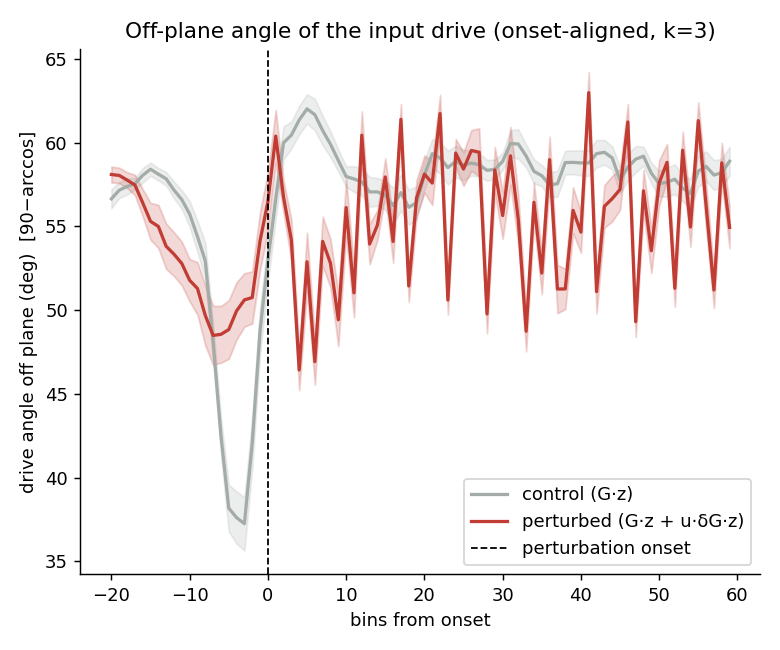
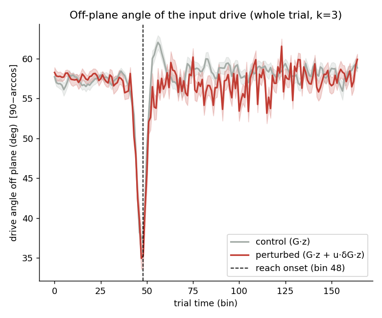
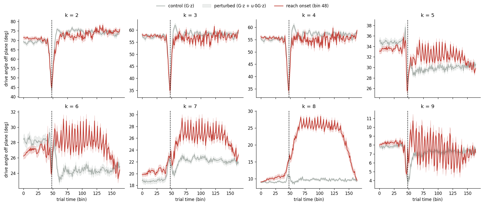
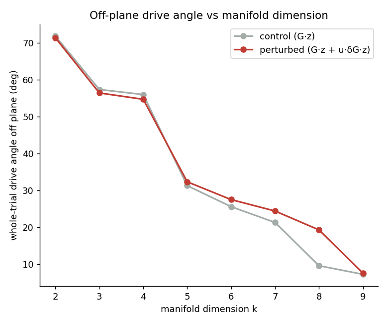

# Off-plane angle of the input drive (calcium Plot 2) — session 6

*Auto-generated by `run_all_sessions.py`. Drive: control = G·z, perturbed = G·z + u·δG·z; angle off plane = `90−arccos` = `arcsin(‖v⊥‖/‖v‖)`. Manifold = trial-averaged unperturbed latent trajectory, **k = 3** of p = 10.*

## Onset-aligned (k = 3)

| | drive angle off plane | p |
|---|---|---|
| perturbed, post-onset | 55.53 ± 2.64° | — |
| control (G·z) | 57.30 ± 1.14° | perturbed>control: **1.000** |
| perturbed, pre-onset | 52.72 ± 4.64° | post>pre: **1.38e-04** |

## Whole trial — no onset alignment (closest to the old calcium plot)

| | whole-trial drive angle off plane | p |
|---|---|---|
| perturbed (G·z + u·δG·z) | 56.37 ± 1.53° | perturbed>control: **1.000** |
| control (G·z) | 57.30 ± 1.14° | |

Per-k whole-trial time courses:

## Robustness to manifold dimension k (whole trial)

| k | manifold var% | control | perturbed | gap |
|---|---|---|---|---|
| 2 | 89.7% | 71.8° | 71.3° | -0.5 |
| 3 | 97.4% | 57.3° | 56.4° | -0.9 |
| 4 | 98.9% | 55.9° | 54.6° | -1.3 |
| 5 | 99.7% | 31.2° | 32.3° | +1.0 |
| 6 | 99.9% | 25.5° | 27.5° | +1.9 |
| 7 | 100.0% | 21.3° | 24.4° | +3.1 |
| 8 | 100.0% | 9.5° | 19.2° | +9.7 |
| 9 | 100.0% | 7.2° | 7.5° | +0.3 |

> The control baseline shrinks as k grows (the manifold absorbs more of the G·z drive), but the perturbed>control gap persists across k. The gap mixes the δG effect with kinematic trial-group differences; see `validate_report.md` Test C for the δG-isolating counterfactual.

