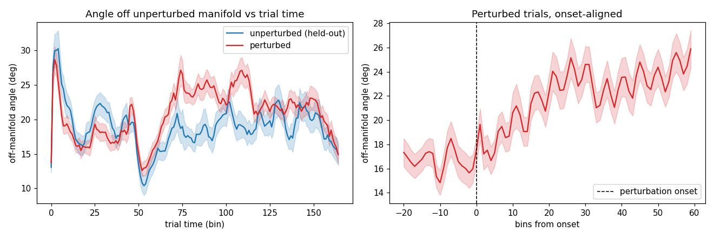
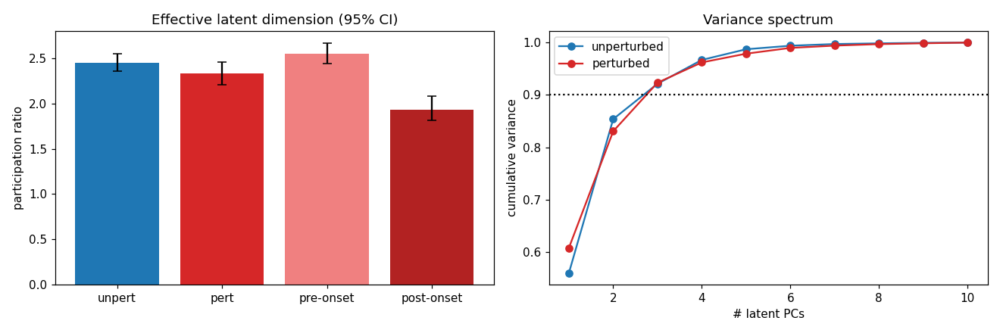
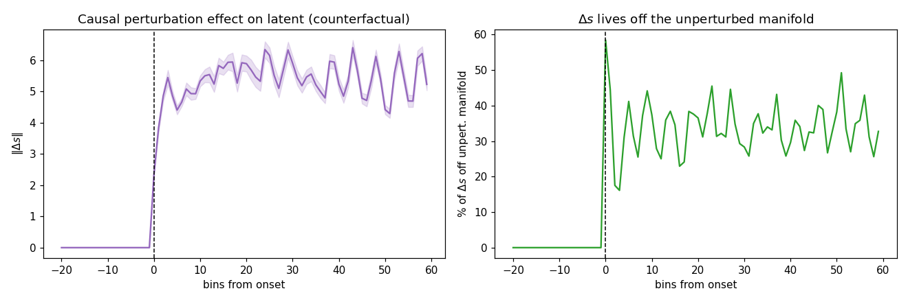

# Validation of the perturbation PLDS latent — session 6 (p = 10)

*Auto-generated by `run_all_sessions.py`. Fit cached in `fit_p10.pkl`; figures `validate_A/B/C_*.png`.*

## Setup
- **141 trials**: 60 perturbed, 81 unperturbed; latent dim **p = 10**, lag J = 3.
- Unperturbed manifold dimension (90% var, train half): **k = 3**.
- Median perturbation onset (trimmed): bin 51; final ELBO -431,737.

## A. Off-manifold angle (perturbed leaves the unperturbed manifold)

Angle of each latent state off the held-out unperturbed manifold (`arcsin(‖s⊥‖/‖s‖)`), onset-aligned.

| comparison | angle | p |
|---|---|---|
| perturbed, post-onset | 22.11 ± 5.98° | — |
| unperturbed (held-out) | 18.95 ± 2.47° | perturbed>unpert: **0.009** |
| perturbed, pre-onset | 16.93 ± 5.84° | post>pre: **6.85e-07** |

## B. Effective dimensionality (participation ratio)

`PR = (Σλ)²/Σλ²` of the latent covariance, equal-N bootstrap (95% CI). Key contrast is pre- vs post-onset *within* perturbed trials.

| condition | participation ratio (95% CI) |
|---|---|
| unperturbed | 2.45 [2.36, 2.55] |
| perturbed (whole trial) | 2.34 [2.21, 2.46] |
| perturbed, **pre-onset** | 2.56 [2.44, 2.67] |
| perturbed, **post-onset** | 1.93 [1.81, 2.08] |

Fraction of perturbed variance outside the 3-D manifold: **10.1%**.

## C. Mechanism — counterfactual (δG-on vs δG-off, kinematics fixed)

| quantity | value |
|---|---|
| ‖Δs‖ pre-onset | 0.000 (≈0 by construction) |
| ‖Δs‖ post-onset | 5.341 |
| Δs off manifold (post) | 33.8% |
| realized δG drive off manifold | 44.6% |
| participation ratio of Δs | 2.96 |

> Onset alignment is essential: whole-trial averages dilute the effect; the dimensional expansion is transient and onset-locked.

