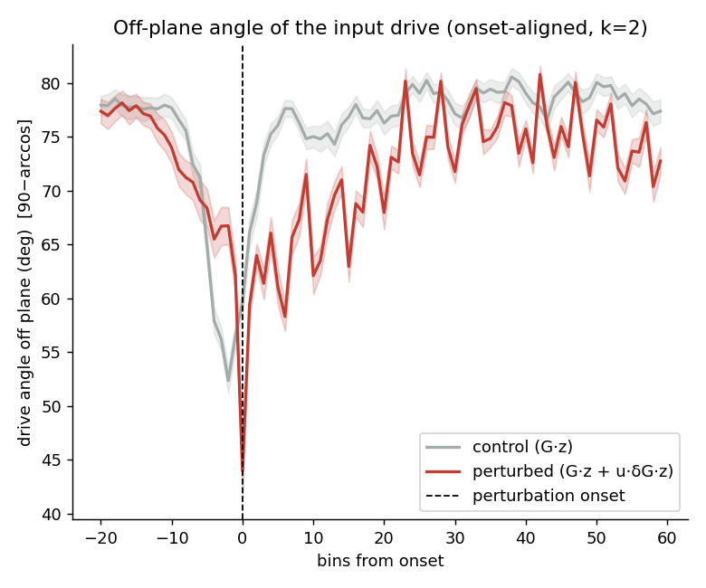
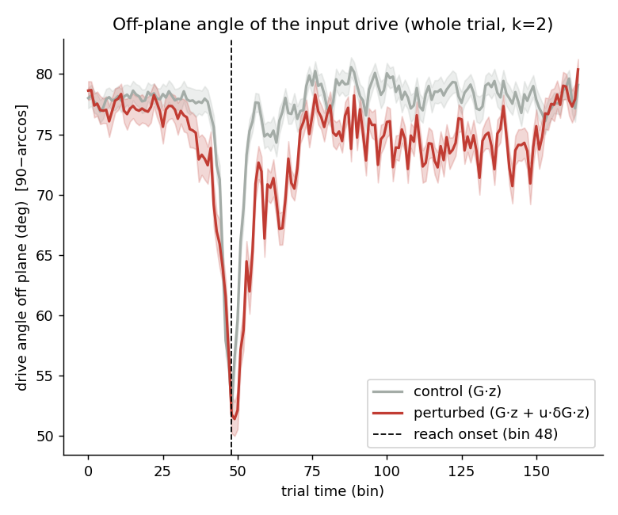
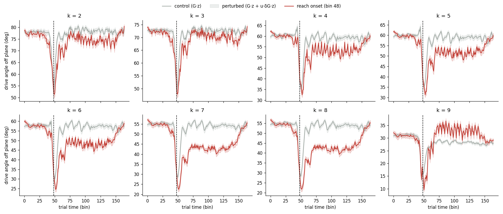
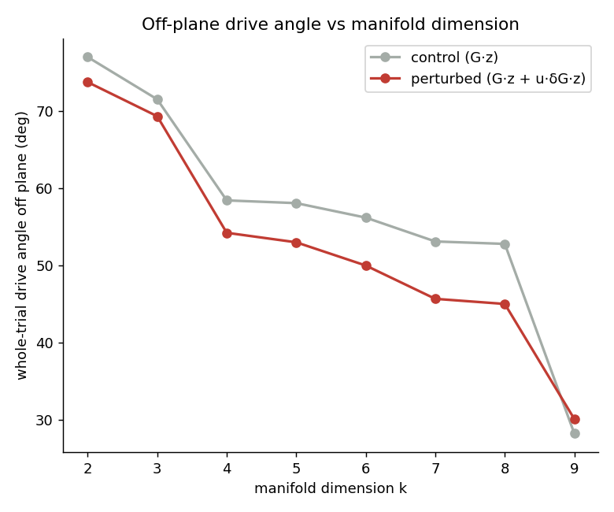

# Off-plane angle of the input drive (calcium Plot 2) — session 7

*Auto-generated by `run_all_sessions.py`. Drive: control = G·z, perturbed = G·z + u·δG·z; angle off plane = `90−arccos` = `arcsin(‖v⊥‖/‖v‖)`. Manifold = trial-averaged unperturbed latent trajectory, **k = 2** of p = 10.*

## Onset-aligned (k = 2)

| | drive angle off plane | p |
|---|---|---|
| perturbed, post-onset | 71.62 ± 2.98° | — |
| control (G·z) | 77.04 ± 3.88° | perturbed>control: **1.000** |
| perturbed, pre-onset | 72.86 ± 7.62° | post>pre: **0.942** |

## Whole trial — no onset alignment (closest to the old calcium plot)

| | whole-trial drive angle off plane | p |
|---|---|---|
| perturbed (G·z + u·δG·z) | 73.79 ± 3.12° | perturbed>control: **1.000** |
| control (G·z) | 77.04 ± 3.88° | |

Per-k whole-trial time courses:

## Robustness to manifold dimension k (whole trial)

| k | manifold var% | control | perturbed | gap |
|---|---|---|---|---|
| 2 | 94.3% | 77.0° | 73.8° | -3.3 |
| 3 | 98.8% | 71.6° | 69.4° | -2.2 |
| 4 | 99.4% | 58.4° | 54.2° | -4.2 |
| 5 | 99.7% | 58.1° | 53.0° | -5.1 |
| 6 | 99.9% | 56.2° | 50.0° | -6.2 |
| 7 | 99.9% | 53.1° | 45.7° | -7.4 |
| 8 | 100.0% | 52.8° | 45.0° | -7.8 |
| 9 | 100.0% | 28.2° | 30.1° | +1.9 |

> The control baseline shrinks as k grows (the manifold absorbs more of the G·z drive), but the perturbed>control gap persists across k. The gap mixes the δG effect with kinematic trial-group differences; see `validate_report.md` Test C for the δG-isolating counterfactual.

